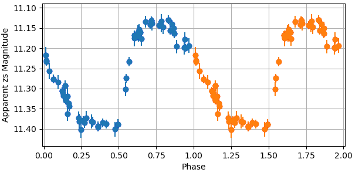
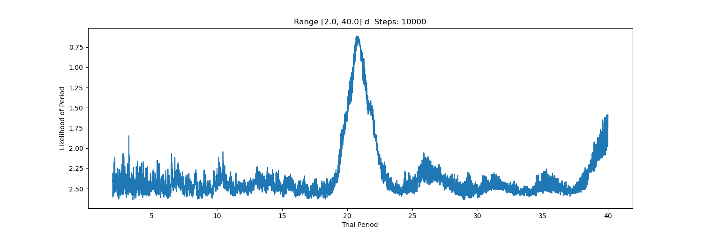
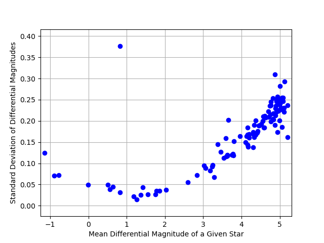

# Summary

Variable star photometry is often promoted as a key research area where non-professionals can travel across the professional divide and provide meaningful contributions to scientific research. The divide is not often traversed as much as it could. On the one side, non-professionals can get lost and confused in the divide -- usually being bogged down in data reduction (as compared to analysis) -- when trying to make multiple decisions on parameters they are not expert in. On the opposite side, professionals can have, an often justified, suspicion of the quality of photometric results from non-experts. ``astrosource`` seeks to bridge this divide by providing a  homogenous automated toolkit to reduce and calibrate astronomical measurements. The tool also facilitates  scientific outreach use of automated robotic telescopes by providing necessary capacity to fully automate the process from image request through to image reduction and resulting display.

# Statement of need

There have been many claims over the last few decades that access to remote and robotic observatories
would be a game-changer in allowing potential contributions to astronomical research by those without
formal postgraduate training (e.g. @gomez2017robotic; @fitzgerald2014review). Whilst access to, and use,
of such telescopes to gather observations has become sufficiently streamlined and accessible, especially
over the last five years, the data - once collected - still needs to be analysed.

There are certain pieces of accessible software that will undertake at least some of the analysis functionality in terms of image processing (such as image reduction (e.g. Maxim DL\footnote{https://diffractionlimited.com/product/maxim-dl/}), photometric analysis (e.g. Muniwin\footnote{http://c-munipack.sourceforge.net/}), period finding (e.g. Peranso, @paunzen2016peranso) or multiple uses (e.g. AstroImageJ, @collins2017astroimagej). Most of the time a user must undertake each step of the procedure in a manual manner. Each step in the procedure is prone to problematic decisions that are made by the user based on an incomplete understanding, or alternative conception, of the scientific assumptions underlying the decision. At worst, these decisions can be made on the basis of incomplete or misleading information from other non-professionals. Such a process, undertaken manually, can take hours to weeks of time by the user. If an incorrect decision or calculation is made at any stage, not only does the process need to be repeated, it can generally be unclear to the non-expert why the results are not meeting expectations.

What is more, most of the steps, typically undertaken manually, are relatively straightforward decisions that can be boiled down to algorithms that can be undertaken more completely and robustly in an automated manner. Take, for instance, choosing  an appropriate comparison star. Many observer guides outline the considerations and rules of thumb to make a "best guess" for the most appropriate comparison star from the analysis of a single image. Given any dataset though, the most appropriate comparison star can be chosen directly and automatically from analysis of the dataset itself. Rather than a human making a "best guess" at an appropriate comparison star, an algorithm can pick out the most objectively appropriate comparison star for any given dataset based on an analysis of the dataset itself and what information may be drawn in from online databases.

Algorithmically automating processes that are typically, but needlessly, undertaken manually by the observer is one of the key aims of ``astrosource``. While other automated timeseries analysis pipelines do exist, ``astrosource`` aims to fill a niche for the non-expert observer, while still providing high quality, publication-appropriate analysis. ``astrosource`` is aimed to be a general purpose tool for any set of varying typical astronomical data, unlike, for example the EXOTIC pipeline (e.g. @zellem2020utilizing; @exotic), which although has a similar philosophy is focussed solely on exoplanets with a transit model-fit being their ultimate goal.

There are, of course, many fully featured pipelines in existence for general professional use, however they require significant expertise to set up, usually on OS’s or codebases quite alien to the non-professional, as well as requiring sufficient knowledge on the part of the user to set the initial parameters. This presents a barrier to use orders of magnitudes larger for the uninitiated. Some of the tentativeness of professionals to trust data from non-professional astronomers is that typically such data is treated in a heterogenous, idiosyncratic manner from observer to observer with no guarantee of quality. Having a tool such as ``astrosource`` that can homogenise and standardise such data analysis while making non-professional observations more accessible and trustable to professional observers is an important contribution to astronomical citizen science as well as amateur and professional research.

# Usage

``astrosource`` has 2 main goals: to provide a fast route to high quality analysed data; to calculate the optimal settings for the data analysis.

Currently ``astrosource`` requires input files with source brightness data, provided in either ``csv`` format, in the form RA, Dec, XPixel, YPixel. counts and error in counts, or FITS table data. ``astrosource`` will currently only process multiextension FITS data, such as from Las Cumbres Observatory (@brown2013cumbres), that contain embedded SEP photometry (@sep2016), such as provided by the BANZAI pipeline (@mccully2018real).

Astrosource can also be used, in a non-intended manner, to calibrate photometry of non-varying target
sources as long as a sufficient number of images is taken, over time, in order to select appropriate
comparison stars.

# Features and Performance

An important consideration with ``astrosource`` is to appeal to a large cross-section of potential users.
For this reason, ``astrosource`` has 2 interfaces: a command-line interface which can be called with a
limited set of inputs (``astrosource/CLI``); a Python package (``astrosource/PKG``) which backends the command-line utility, and has more flexibility. ``astrosource`` is available on PyPi and so is trivial to install. ``astrosource/CLI`` has been designed to automatically find the optimal values for the majority of settings, whereas ``astrosource/PKG`` allows for full access to the ``astrosource`` API. Natually, ``astrosource/CLI`` is providing a thin wrapper around ``astrosource/PKG``.

The basic functionality of ``astrosource`` algorithmically encodes the previously manual steps undertaken
in data analysis.

* Identify stars of sufficient signal-to-noise that exist within the linear range of the observing camera that are in every frame
* Calculate the variability of all of these identified stars to extract the least variable stars to be used as an ensemble set of comparison stars.
* Provide the variability of all stars within the dataset as a catalogue to facilitate variable source identification.
* Calibrate the ensemble set to known stars in the field from APASS (@henden2015apass), SDSS (@alam2015eleventh), PanSTARRS (@magnier2016pan) or Skymapper (@wolf2018skymapper) depending on filter selection and declination.
* Extract the photometric measurements and plot lightcurves of provided target stars.
* Use period-search algorithms to find periodicity in the extracted lightcurves. Currently using Phase-Dispersion Minimization and String-Length algorithms writing by [@altunin2020period] with more planned.
* Use box-finding algorithms (@kovacs2002box) to find transit-like features in the extracted lightcurves.
* Produce labelled and annotated output plots and a variety of data-files allowing further analysis and reporting.

``astrosource`` makes use of ``NumPy``[@numpy] for reading and storing photometry files, ``astropy`` (@astropy:2013; @astropy:2018) for fits handling and source identifications, ``astroquery`` for source and catalogue matching, and ``matplotlib`` [@matplotlib] for plotting
(only if using CLI). Leveraging these highly developed and well supported packages allows ``astrosource``
to be fast and efficient at time-series analysis.

Performing time-series analysis manually using GUI-based software packages can take hours. ``astrosource``
takes between seconds to minutes for an equivalent analysis. While this is attractive in and of itself,
``astrosource`` also can catch nuances that will never be easily accessible to the inexperienced observer.
For instance, in the z-band in both SDSS and PanSTARRS catalogues, some provided photometry is poor quality or
misleading, particularly for brighter sources, where certain glitches that have arisen in particular parts
of the night sky or on the edges of mosaicked images, leading to dramatically incorrect estimates of
apparent magnitude. Solutions to avoid these issues have been easily incorporated into the ``astrosource``
code, but would likely be cumbersome to explain manually in any given observer guide.

Some examples of the output of ``astrosource`` are:

* An RRc type RR Lyrae star folded lightcurve in zs calibrated to PanSTARRS shown in \autoref{fig:rrc}

* A Phase-Dispersion-Minimization (PDM) likelihood plot for a Cepheid variable with a 20 day period shown in \autoref{fig:pdm}

* A plot of the standard deviation variability of each star in the data set compared to the ensemble comparison star a shown in \autoref{fig:starvar}. An RRab type RR Lyrae stands out as an identified variable star from the other constant stars in the dataset.

* A transit model fit using EXOTIC to data produced by ``astrosource`` as shown in \autoref{fig:exotic}.

``astrosource`` is under continual development and is responsive to new situations where new glitches occur
due to the differing nature of datasets and different nature of calibration. Astrosource has been used
by over one hundred different non-expert users to great effect (e.g. [@jones2020new; @sarva2020exoplanet])
and we acknowledge their support and patience as we incorporate new algorithms into the script in order
to help drive non-professional engagement with astronomy research.

# Acknowledgements

Dr. Michael Fitzgerald is the recipient of an Australian Research Council Discovery Early Career Award
(project number DE180100682) funded by the Australian Government. We acknowledge the support of Las Cumbres
Observatory and it’s Global Sky Partner program which facilitated the development of this software as well
as the hundreds of students who have bumped into small (and not so small) errors involved in this software
along it’s development previously and into the future. Gomez and the Global Sky Partner program is supported by the Simons Foundation.

# References
